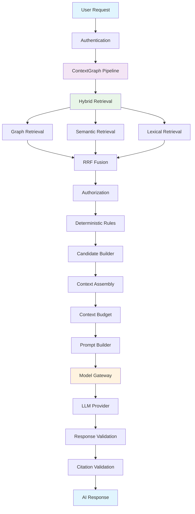
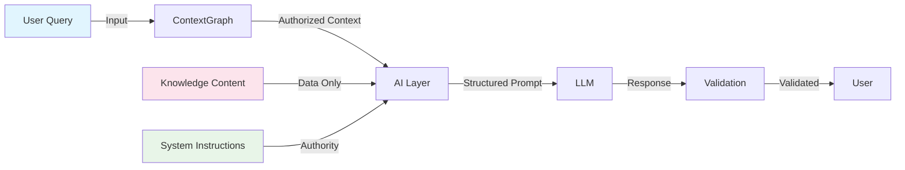
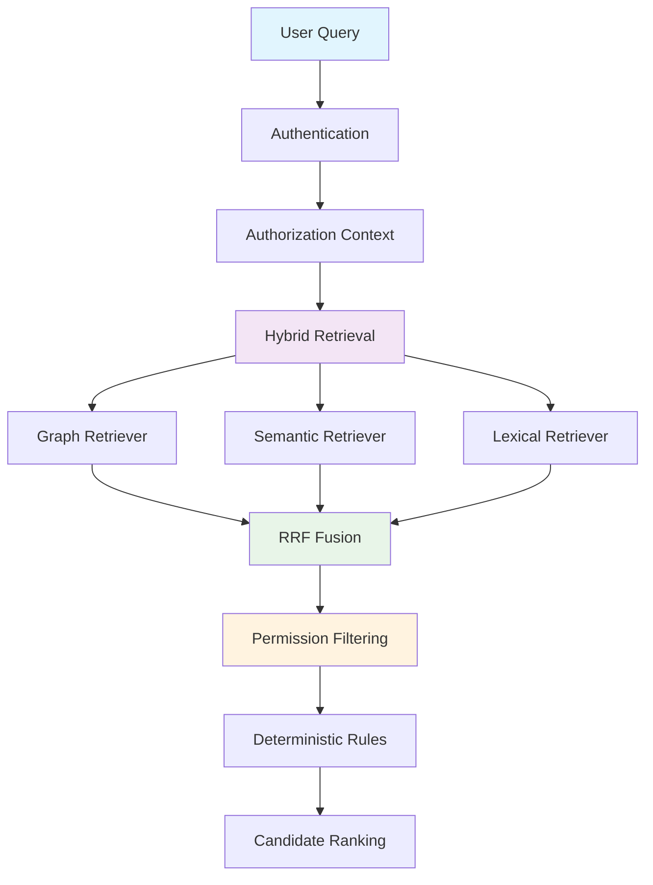
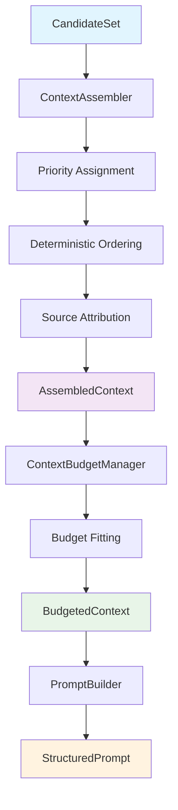
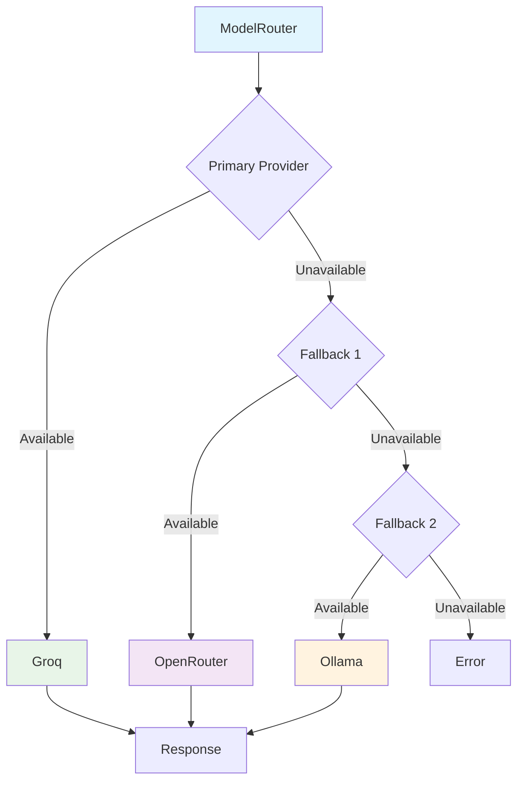
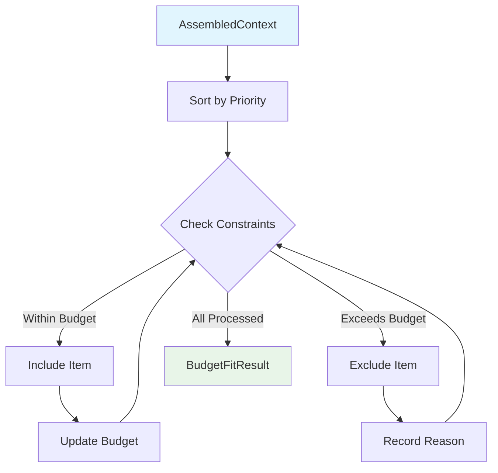

# AI Architecture — ContextGraph AI Context Layer

Phase 11 implements the AI Context Layer on top of the existing deterministic ContextGraph infrastructure.

## Core Principle

**ContextGraph decides WHAT enters the AI context. The LLM decides HOW to use that context.**

The LLM must NEVER determine what information the user is authorized to access.

## Architecture Overview



## Security Architecture



## Module Structure

```
apps/api/src/modules/
├── ai/                          # AI Context Layer
│   ├── domain/
│   │   ├── ai.types.ts          # Core domain types
│   │   └── ai.interfaces.ts     # Service interfaces
│   ├── services/
│   │   ├── ai.service.ts        # Main orchestrator
│   │   ├── context-assembler.service.ts
│   │   ├── context-budget-manager.service.ts
│   │   ├── token-estimator.service.ts
│   │   ├── context-compressor.service.ts
│   │   ├── prompt-builder.service.ts
│   │   ├── model-router.service.ts
│   │   ├── citation-validator.service.ts
│   │   ├── response-validator.service.ts
│   │   ├── context-hasher.service.ts
│   │   └── cost-calculator.service.ts
│   ├── adapters/
│   │   ├── groq.adapter.ts      # Groq (OpenAI-compatible)
│   │   ├── openrouter.adapter.ts # OpenRouter (multi-provider)
│   │   └── ollama.adapter.ts    # Ollama (local)
│   ├── controllers/
│   │   └── ai.controller.ts     # API endpoints
│   ├── dto/
│   │   └── ai-chat-request.dto.ts
│   └── ai.module.ts             # Module composition
│
└── retrieval/                   # Hybrid Retrieval System
    ├── domain/
    │   ├── retrieval.types.ts   # Retrieval domain types
    │   └── retrieval.interfaces.ts # Service interfaces
    ├── services/
    │   ├── retrieval.service.ts # Main orchestrator
    │   ├── vector-store.service.ts
    │   ├── embedding.service.ts
    │   ├── chunker.service.ts
    │   └── indexing.service.ts
    ├── adapters/
    │   ├── graph-retriever.adapter.ts
    │   ├── semantic-retriever.adapter.ts
    │   ├── lexical-retriever.adapter.ts
    │   └── hybrid-retriever.adapter.ts
    ├── jobs/
    │   ├── indexing.processor.ts
    │   └── indexing-queue.service.ts
    ├── controllers/
    │   └── retrieval.controller.ts
    ├── dto/
    │   └── search-retrieval.dto.ts
    └── retrieval.module.ts
```

## API Endpoints

### AI Chat

```
POST /api/v1/ai/chat
```

Request:

- userQuery: The user's question
- entryNodeId: Starting node for context retrieval
- workspaceId: Workspace scope
- conversationId: Optional conversation thread
- conversationHistory: Previous turns
- configuration: Optional model overrides

Response:

- answer: Generated response
- citations: Validated citations
- model: Model used
- provider: Provider used
- usage: Token usage and cost
- contextVersion: Context version
- contextHash: Deterministic context hash
- promptHash: Deterministic prompt hash
- latencyMs: Response latency
- requestId: Request identifier
- pipelineVersion: Pipeline version

### Streaming Chat

```
POST /api/v1/ai/chat/stream
```

Returns Server-Sent Events (SSE) with streaming response chunks.

### Hybrid Retrieval

```
POST /api/v1/retrieval/search
```

Request:

- userQuery: Search query
- workspaceId: Workspace scope
- entryNodeId: Starting node for graph traversal
- mode: GRAPH_ONLY | SEMANTIC_ONLY | LEXICAL_ONLY | HYBRID
- graphTopK, semanticTopK, lexicalTopK, finalTopK: Result limits
- enableGraph, enableSemantic, enableLexical: Enable/disable methods
- graphWeight, semanticWeight, lexicalWeight: Fusion weights
- minSimilarity: Minimum semantic similarity threshold
- nodeTypes, statuses, complianceTags, departments: Filters

Response:

- candidates: Retrieved candidates with explanations
- mode: Retrieval mode used
- totalResults: Total candidates
- graphResults, semanticResults, lexicalResults: Source results
- fusionMetadata: RRF configuration and stats
- metrics: Performance metrics

## Retrieval Architecture



### Reciprocal Rank Fusion (RRF)

The hybrid retriever uses RRF to combine results:

```
score(d) = Σ w_i * 1/(k + rank_i(d))
```

Where:

- `d` = document/candidate
- `k` = constant (60, standard value from literature)
- `w_i` = weight for retrieval method i
- `rank_i(d)` = rank of document d in result list i (1-indexed)

### Security Model

**Critical**: Semantic retrieval MUST NEVER bypass:

- Authentication
- Organization isolation
- Permissions
- Compliance requirements
- Deterministic rules

## Context Assembly Pipeline



## Priority Tiers

| Tier     | Threshold       | Budget Behavior                                  |
| -------- | --------------- | ------------------------------------------------ |
| CRITICAL | importance ≥ 90 | Never removed unless individually exceeds budget |
| HIGH     | importance ≥ 70 | Preferred over NORMAL/LOW                        |
| NORMAL   | distance ≤ 1    | Standard inclusion                               |
| LOW      | default         | First to be excluded                             |

## Provider Architecture



## Prompt Injection Defense

The architecture defends against prompt injection through:

1. **Instruction Hierarchy**: System instructions > Context data > User query
2. **Context Boundaries**: All knowledge content wrapped in `<context>` tags
3. **Data Treatment**: Knowledge content treated as untrusted data
4. **User Query Isolation**: User queries cannot modify authorization
5. **Validation**: Response validation for forbidden patterns

## Token Budget Management



## Cost Control

| Provider   | Model         | Input Cost | Output Cost |
| ---------- | ------------- | ---------- | ----------- |
| Groq       | llama-3.3-70b | $0.59/1M   | $0.79/1M    |
| OpenRouter | llama-3.3-70b | $0.35/1M   | $0.40/1M    |
| Ollama     | local         | $0         | $0          |

## Configuration

Environment variables:

```bash
# Provider Selection
AI_PRIMARY_PROVIDER=GROQ
AI_FALLBACK_PROVIDERS=OPENROUTER,OLLAMA

# API Keys
GROQ_API_KEY=gsk_...
OPENROUTER_API_KEY=sk-or-...

# Cost Limits
AI_MAX_COST_PER_REQUEST=0.10
AI_MAX_COST_PER_USER=1.00
AI_MAX_COST_PER_ORG=10.00

# Local Models
OLLAMA_BASE_URL=http://localhost:11434

# Embedding Configuration
EMBEDDING_PROVIDER=OPENAI
EMBEDDING_MODEL=text-embedding-3-small
EMBEDDING_DIMENSIONS=1536
EMBEDDING_BATCH_SIZE=100
OPENAI_API_KEY=your-key
```

## Testing Strategy

### Unit Tests

- ContextAssembler: priority assignment, ordering, hashing
- ContextBudgetManager: budget fitting, constraint enforcement
- TokenEstimator: provider-independent estimation
- CitationValidator: citation detection and validation
- ResponseValidator: structure and content validation
- RetrievalService: authorization filtering, cross-tenant protection

### Security Tests

- Prompt injection in knowledge content
- Instruction hierarchy preservation
- Authorization bypass attempts
- Cross-tenant data leakage
- Cross-tenant retrieval prevention

### Integration Tests

- Full pipeline: ContextPackage → AI Response
- Hybrid retrieval: Graph + Semantic + Lexical → RRF Fusion
- Provider fallback scenarios
- Cost budget enforcement

## Observability

Tracked metrics:

- Model calls per provider
- Latency per request
- Token usage
- Cost per request
- Citation validation failures
- Circuit breaker state changes
- Retrieval query latency
- Embedding generation latency
- Vector search latency
- Fusion latency
- Cache hit rate

## Documentation

- [Context Assembly](./context-assembly.md)
- [Model Gateway](./model-gateway.md)
- [AI Security](./ai-security.md)
- [Retrieval Architecture](./retrieval-architecture.md)
