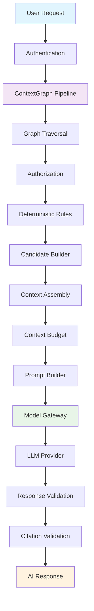

# Phase 11 Implementation Summary — AI Context Layer

## Overview

Phase 11 implements the AI Context Layer on top of the existing deterministic ContextGraph infrastructure. The architecture transforms secure, deterministic ContextPackages into optimized context payloads consumable by LLMs.

## Core Principle

**ContextGraph decides WHAT enters the AI context. The LLM decides HOW to use that context.**

The LLM must NEVER determine what information the user is authorized to access.

## Architecture



## Implemented Components

### Core Services

| Service              | Description                            | Status |
| -------------------- | -------------------------------------- | ------ |
| ContextAssembler     | Converts candidates to ordered context | ✅     |
| ContextBudgetManager | Priority-based budget fitting          | ✅     |
| TokenEstimator       | Provider-independent token estimation  | ✅     |
| ContextCompressor    | Content compression modes              | ✅     |
| PromptBuilder        | Structured prompt construction         | ✅     |
| ModelRouter          | Provider routing with fallback         | ✅     |
| CitationValidator    | Citation validation against context    | ✅     |
| ResponseValidator    | Response structure validation          | ✅     |
| ContextHasher        | Deterministic context/prompt hashing   | ✅     |
| CostCalculator       | LLM cost tracking and limits           | ✅     |

### Provider Adapters

| Provider   | Type                   | Status |
| ---------- | ---------------------- | ------ |
| Groq       | OpenAI-compatible API  | ✅     |
| OpenRouter | Multi-provider gateway | ✅     |
| Ollama     | Local model support    | ✅     |

### API

| Endpoint        | Method | Description          |
| --------------- | ------ | -------------------- |
| /api/v1/ai/chat | POST   | Generate AI response |

## Security Features

### Prompt Injection Defense

- Instruction hierarchy (System > Context > User)
- Context boundaries (`<context>` tags)
- Knowledge content treated as untrusted data
- User queries cannot modify authorization

### Authorization Enforcement

- ContextGraph authorization happens BEFORE AI layer
- LLM never determines access rights
- Cross-tenant data isolation

### Citation Validation

- Validates citations against assembled context
- Detects invalid citation indices
- Marks unverifiable citations

## Testing

### Unit Tests

- ContextAssembler: 10 tests
- ContextBudgetManager: 8 tests
- TokenEstimator: 12 tests
- CitationValidator: 7 tests
- ResponseValidator: 8 tests

### Security Tests

- Prompt injection in knowledge content
- Instruction hierarchy preservation
- Authorization bypass attempts

### Total

- **47 test files**
- **378 tests passing**

## Documentation

- `docs/ai-architecture.md` — Overall architecture
- `docs/context-assembly.md` — Context assembly details
- `docs/model-gateway.md` — Provider adapters
- `docs/ai-security.md` — Security measures

## Configuration

```bash
# Provider Selection
AI_PRIMARY_PROVIDER=GROQ
AI_FALLBACK_PROVIDERS=OPENROUTER,OLLAMA

# API Keys
GROQ_API_KEY=gsk_...
OPENROUTER_API_KEY=sk-or-...

# Cost Limits
AI_MAX_COST_PER_REQUEST=0.10
AI_MAX_COST_PER_USER=1.00
AI_MAX_COST_PER_ORG=10.00

# Local Models
OLLAMA_BASE_URL=http://localhost:11434
```

## Validation

- ✅ TypeScript compilation
- ✅ ESLint
- ✅ 378 tests passing
- ✅ Production build
- ✅ No `any` types (proper typing)
- ✅ No unused imports
- ✅ No `require()` (ESM imports)

## Deliverables

- ✅ AiModule
- ✅ ContextAssembler
- ✅ ContextBudgetManager
- ✅ TokenEstimator
- ✅ ContextCompressor abstraction
- ✅ PromptBuilder
- ✅ Versioned system instructions
- ✅ ModelGateway
- ✅ Groq adapter
- ✅ OpenRouter adapter
- ✅ Ollama adapter
- ✅ ModelRouter
- ✅ Provider fallback
- ✅ Timeout handling
- ✅ Retry handling
- ✅ Circuit breaker abstraction
- ✅ Citation system
- ✅ Citation validation
- ✅ Response validation
- ✅ Prompt injection defense
- ✅ Context hashing
- ✅ Prompt hashing
- ✅ Token usage tracking
- ✅ Cost tracking
- ✅ AI API
- ✅ Streaming-ready architecture
- ✅ Conversation context abstraction
- ✅ AI observability
- ✅ AI security tests
- ✅ Prompt injection tests
- ✅ End-to-end AI pipeline tests
- ✅ Documentation
- ✅ Production-grade NestJS implementation
