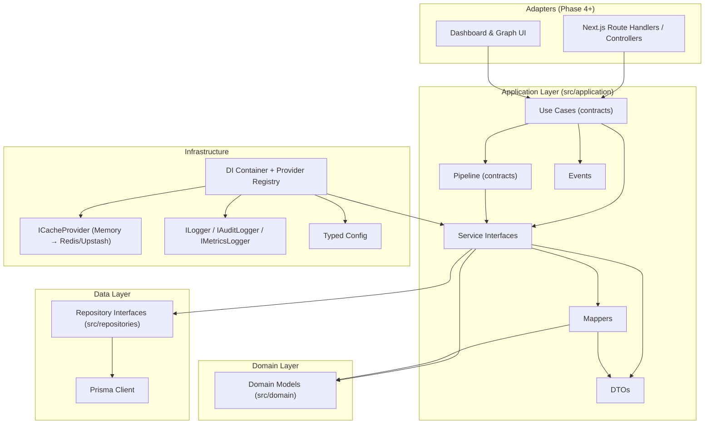
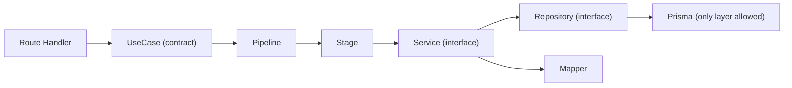
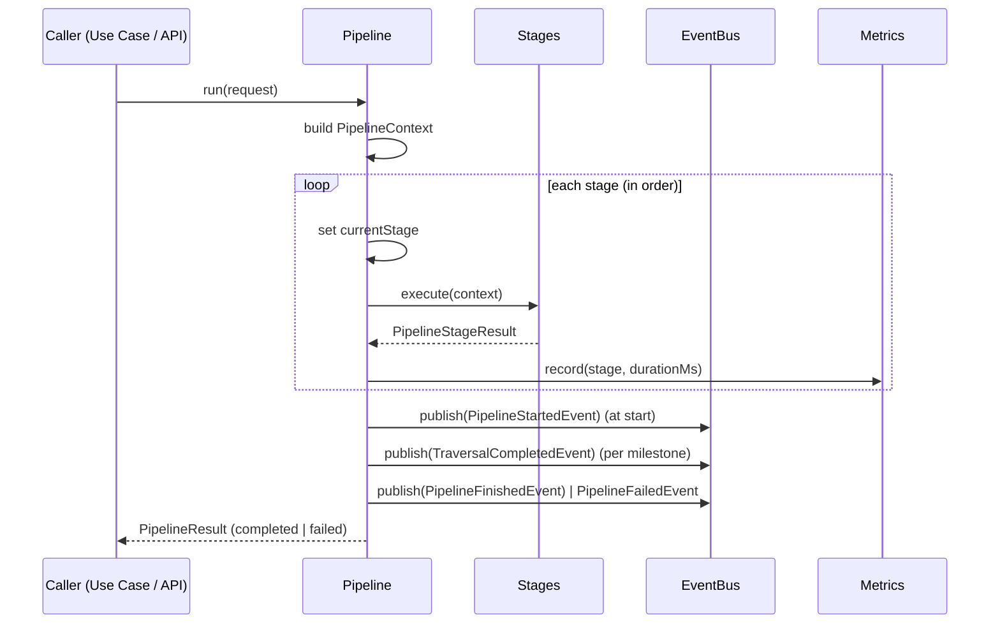
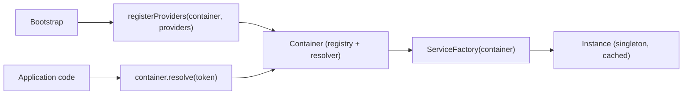

# Application Layer Architecture (Phase 3)

> Status: **Contracts only.** This phase declares the application layer every
> future business module plugs into — service interfaces, use-case contracts,
> pipeline contracts, DTOs, events, caching, configuration, logging, and the
> DI machinery. **Business logic is exactly zero.** Implementations land in
> Phase 4+ and are bound in the DI container.

## Layer diagram

## Dependency flow

Rules enforced by construction:

1. **No application code touches Prisma.** Everything flows through the
   repository interfaces (`src/repositories`).
2. **Services depend on interfaces** (`src/application/services/interfaces`),
   never concrete implementations — replaceability is a one-line provider
   binding.
3. **DTOs are pure types** — no logic, no ORM references. Domain models are
   the canonical entity contract; mappers convert at the boundary.
4. **Dependency direction** flows inward: `dto → contracts → pipelines →
services → use cases`, with `di`, `logging`, `caching`, `config` as
   horizontally shared infrastructure.

## Pipeline flow

The ten stages, in order:

| #   | Stage kind            | Responsibility                                |
| --- | --------------------- | --------------------------------------------- |
| 0   | `PERMISSION`          | Compile the caller permission context         |
| 1   | `ENTRY_RESOLVER`      | Resolve the traversal entry nodes             |
| 2   | `GRAPH_TRAVERSAL`     | Walk the knowledge graph from the entry nodes |
| 3   | `ZONE_INJECTION`      | Inject zone/department context nodes          |
| 4   | `ISOLATION_FILTER`    | Enforce organization/workspace isolation      |
| 5   | `COMPLIANCE_FILTER`   | Filter nodes by compliance clearance          |
| 6   | `PERMISSION_FILTER`   | Apply explicit grants/denials                 |
| 7   | `TEMPORAL_FILTER`     | Prune nodes outside their validity window     |
| 8   | `DERIVABILITY_FILTER` | Prune derivable or low-value nodes            |
| 9   | `CANDIDATE_BUILDER`   | Rank and assemble the candidate set           |

Every stage implements the single `PipelineStage` contract, so stages are
**reorderable, swappable and pluggable** without touching the orchestrator or
any other stage. New stages are added to `src/application/pipelines/stages.ts`
(the registry) — nothing else changes.

## Service responsibilities

| Interface                | Responsibility                                            |
| ------------------------ | --------------------------------------------------------- |
| `IPermissionCompiler`    | Compile effective permission context (grants/denials)     |
| `IGraphTraversalService` | Traverse the graph (BFS now, A* later)                    |
| `IRuleEngine`            | Evaluate deterministic rules (`ContextRule.condition`)    |
| `ICandidateAssembler`    | Rank + assemble the final candidate set                   |
| `IEntryResolver`         | Resolve traversal entry nodes (ids / query / rules)       |
| `IZoneInjector`          | Inject zone/department context nodes                      |
| `IMetricsCollector`      | Record per-stage metrics, snapshot a run                  |
| `INodeClassifier`        | Classify nodes (fact/constraint/decision/anti-pattern)    |
| `IDerivabilityEvaluator` | Score how derivable a node is from its neighbors          |
| `INodeFilter`            | Generic node filter (isolation/compliance/permission/...) |

Use-case contracts (one per file under `src/application/use-cases`):

| Use case                      | Purpose                                         |
| ----------------------------- | ----------------------------------------------- |
| `RunPipelineUseCase`          | Full pipeline run with lifecycle events         |
| `GetCandidateSetUseCase`      | Paginated retrieval of a previous candidate set |
| `ResolveEntryNodeUseCase`     | Standalone entry-node resolution                |
| `CompilePermissionUseCase`    | Standalone permission compilation (cached)      |
| `TraverseGraphUseCase`        | Standalone traversal (APIs, diagnostics, UI)    |
| `FilterKnowledgeNodesUseCase` | Reusable node filtering primitive               |
| `BuildCandidateSetUseCase`    | Candidate assembly from arbitrary node sets     |
| `GetPipelineMetricsUseCase`   | Metrics snapshot for observability              |

Each use case declares its **input DTO, output DTO, dependencies** (the
service contracts it requires) and a **factory contract** — construction is
registered in the DI container, so callers never construct use cases
directly.

## Dependency injection flow

- **Tokens** are branded, strongly typed identifiers (`createToken<T>()`).
- **Factories** receive the container, so transitive dependencies resolve
  automatically.
- **Singleton semantics** by default (one instance per container, lazily
  constructed); `transient` scope is declared for future async extensions.
- **Fail-fast**: registering a token twice or resolving an unbound token
  throws `ConfigurationError` at the first call — never a silent `undefined`.
- Swapping an implementation (BFS → A*, memory cache → Redis) is a change to
  the **provider binding only**.

## Future extension strategy

| Future module           | Slot prepared                                         |
| ----------------------- | ----------------------------------------------------- |
| BFS / A* traversal      | `IGraphTraversalService` implementation               |
| Rule engine             | `IRuleEngine` implementation                          |
| Permission compiler     | `IPermissionCompiler` implementation                  |
| Candidate builder       | `ICandidateAssembler` + `BuildCandidateSetUseCase`    |
| AI context assembly     | consume `PipelineResponse.candidates`                 |
| Analytics               | `IMetricsCollector` / `IMetricsLogger` backends       |
| Real-time updates       | `IEventBus` subscribers on pipeline events            |
| Redis / Upstash caching | `ICacheProvider` implementation + `CacheConfig`       |
| Auth (Supabase/Clerk)   | user identity feeds `UserContextDto` at the API       |
| Testing                 | `src/application/testing` (builders, fixtures, mocks) |

Extending the platform never requires modifying existing modules: add an
implementation, register it in the container, and — where a new stage is
needed — append it to the stage registry.

## Key contracts (quick reference)

- `PipelineRequest` / `PipelineResponse` — canonical IO (aliased as
  `PipelineRequestDto` / `PipelineResponseDto` in `@/application/dto`).
- `PipelineContext` — mutable runtime bag carried through stages.
- `PipelineResult` — discriminated `completed | failed` outcome.
- `PipelineMetrics` — alias of `MetricsContextDto` (single shape, no drift).
- `DomainEvent<T>` — base event; `PipelineEvent` is the discriminated union.
- `Result<T>`, `Paginated<T>`, `Optional<T>`, `Nullable<T>`, `DeepReadonly<T>`,
  `EntityId`, `Timestamp` — defined once in `@/types`, re-exported from
  `@/application/shared`.
