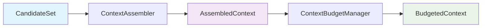

# Context Assembly

Context Assembly transforms ranked candidates from ContextGraph into an ordered context representation for LLM consumption.

## Overview



## ContextAssembler

### Input

- CandidateSet from ContextGraph pipeline
- Entry node ID
- Workspace ID
- Organization ID
- Context version

### Output

- AssembledContext with ordered items
- Source attribution
- Context hash

### Priority Assignment

| Priority | Criteria        | Budget Behavior                                  |
| -------- | --------------- | ------------------------------------------------ |
| CRITICAL | importance ≥ 90 | Never removed unless individually exceeds budget |
| HIGH     | importance ≥ 70 | Preferred over NORMAL/LOW                        |
| NORMAL   | distance ≤ 1    | Standard inclusion                               |
| LOW      | default         | First to be excluded                             |

### Ordering Strategy

1. Entry node first (distance 0)
2. Priority tier descending
3. Rank ascending (lower rank = higher priority)
4. Importance descending
5. Distance ascending
6. Title alphabetical (final tie-break)

### Source Attribution

Every context item includes:

- Node ID
- Organization ID
- Department ID (if applicable)
- Workspace ID
- Document version

## ContextBudgetManager

### Constraints

| Constraint     | Description                     | Default |
| -------------- | ------------------------------- | ------- |
| maxCandidates  | Maximum number of context items | 20      |
| maxCharacters  | Maximum total characters        | 50,000  |
| maxTokens      | Maximum estimated tokens        | 8,000   |
| maxContentSize | Maximum content size            | 100,000 |
| maxSourceCount | Maximum unique sources          | 15      |

### Budget Fitting Algorithm

1. Sort items by priority (descending) then rank (ascending)
2. For each item:
   - Check if adding would exceed any constraint
   - If within budget, include item
   - If exceeds budget, exclude with reason
3. Return included items and exclusion reasons

### Exclusion Reasons

- `TOKEN_BUDGET_EXCEEDED`: Would exceed token limit
- `CHARACTER_BUDGET_EXCEEDED`: Would exceed character limit
- `MAX_CANDIDATES_EXCEEDED`: Would exceed candidate limit
- `SOURCE_COUNT_EXCEEDED`: Would exceed source limit
- `CONTENT_SIZE_EXCEEDED`: Would exceed content size limit

## Context Hashing

The context hash is deterministic and includes:

- Context version
- Ordered candidate IDs
- Ranks
- Entry node ID
- Workspace ID

Used for:

- Debugging
- Caching
- Audit trails
- Reproducibility

## Compression Modes

| Mode           | Description              | Use Case                       |
| -------------- | ------------------------ | ------------------------------ |
| FULL           | Include content verbatim | Entry node, explicit context   |
| SUMMARY        | Deterministic summary    | High importance, near distance |
| COMPRESSED     | Truncated content        | Far distance, lower importance |
| REFERENCE_ONLY | Title + ID only          | Highly derivable content       |

## API Reference

```typescript
// Assemble context from candidates
const context = await assembler.assemble({
  candidates: rankedCandidates,
  entryNodeId: "node-1",
  workspaceId: "ws-1",
  organizationId: "org-1",
  contextVersion: "1.0.0",
});

// Fit to budget
const budgetResult = budgetManager.fitToBudget(context.items, {
  maxCandidates: 20,
  maxTokens: 8000,
  maxCharacters: 50000,
  maxContentSize: 100000,
  maxSourceCount: 15,
});
```
