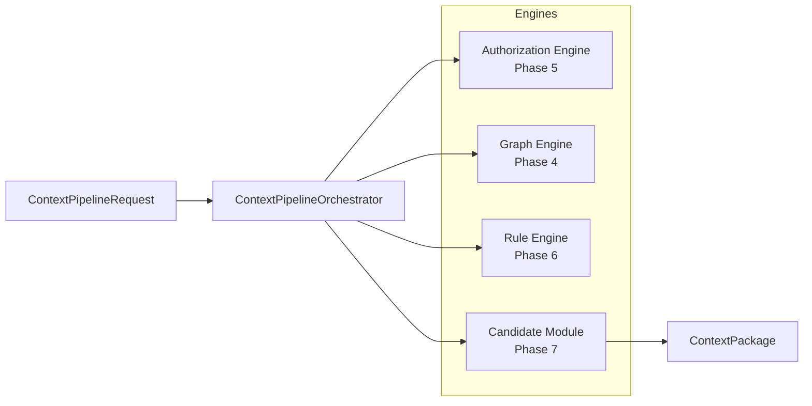
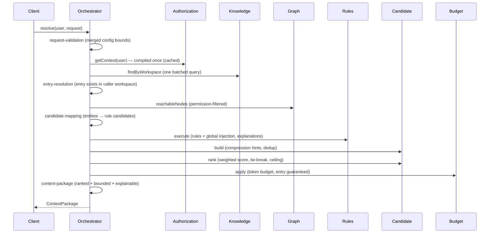
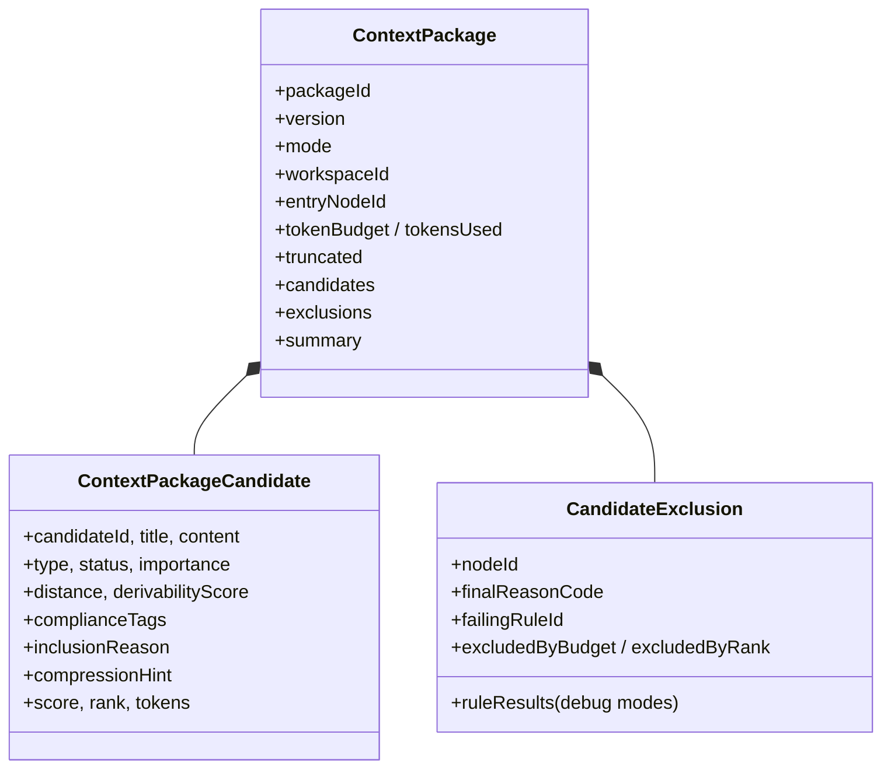
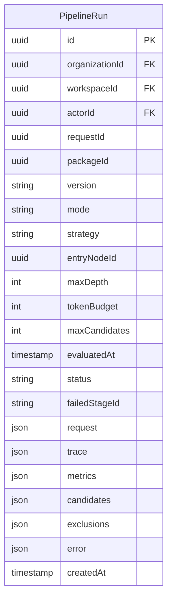
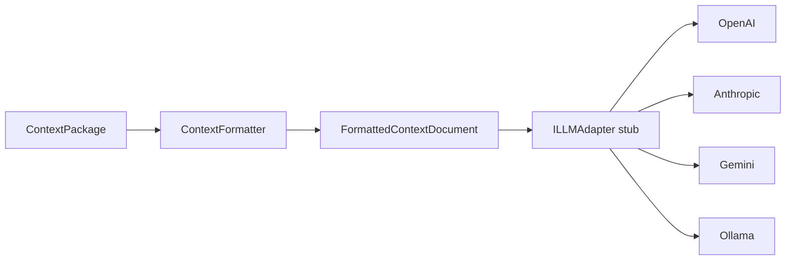

# Context Pipeline & Candidate Builder (Phase 7)

The context pipeline is the first phase where the major ContextGraph engines
work together. It transforms

```
User + Organization + Entry Point
```

into

```
a deterministic, explainable, ranked, bounded ContextPackage
```

There is **zero LLM involvement**. The output is provider-independent and
ready for a future AI context formatter.

---

## 1. Pipeline Architecture



The orchestrator (`apps/api/src/modules/pipeline/orchestrator/`) is a thin
composition service. It **calls** the engine contracts and **never
reimplements** traversal, authorization, rules, or ranking. Every dependency
is an interface token bound in `PipelineModule`, so replacing an engine
(e.g. A\* traversal, a Redis-backed cache, a different ranker) never touches
orchestrator code.

### Module layout

```
apps/api/src/modules/pipeline/
├── orchestrator/context-pipeline-orchestrator.ts   # the composition service
├── contracts/context-pipeline.contracts.ts         # modes, stages, trace, package
├── configuration/pipeline.config.ts                # safe defaults + merge/clamp
├── errors/pipeline-errors.ts                       # pipeline-specific exceptions
├── observability/pipeline-metrics.ts               # IPipelineMetrics seam
├── observability/pipeline-audit.ts                 # IPipelineAuditLogger seam
├── budget/context-budget.ts                        # IContextBudget + token impl
├── validation/context-pipeline.validation.ts       # Zod request schema
├── dto/context-package.dto.ts                      # Swagger surface
└── context-pipeline.controller.ts                  # POST /pipeline/context/resolve

apps/api/src/modules/candidate/
├── domain/candidate-node.ts                        # CandidateNode, RankedCandidate
├── domain/compression-hint.ts                      # FULL/SUMMARY/COMPRESSED/REFERENCE_ONLY
├── candidate.config.ts                             # ranking weights + defaults
├── services/candidate-builder.service.ts           # ICandidateBuilder
├── services/candidate-ranker.service.ts           # ICandidateRanker (deterministic)
└── errors/candidate-errors.ts
```

---

## 2. Stage Responsibilities

Each stage is a discrete, well-named step producing structured metadata
(`PipelineStageResult`: stage id/name, status, timestamps, duration, input and
output counts). Stages are strictly sequential — every stage consumes the
previous stage's output; there is no hidden shared mutation.



| Stage                | Responsibility                                                                                                                  |
| -------------------- | ------------------------------------------------------------------------------------------------------------------------------- |
| `request-validation` | Sanity-check the merged run configuration (defense in depth over Zod).                                                          |
| `authorization`      | Compile the **trusted server-side** authorization context (cached per principal).                                               |
| `entry-resolution`   | Verify the entry node exists in the caller's workspace (404 semantics; one batched entity query doubles as the content source). |
| `graph-traversal`    | Phase 4 reachability, already filtered to nodes the caller may read.                                                            |
| `candidate-mapping`  | Adapt authorized nodes into rule-engine candidates at the module boundary.                                                      |
| `rule-engine`        | Phase 6 deterministic filtering (global injection is its stage 0); every node accumulates a verdict trace.                      |
| `candidate-build`    | Convert rule-passing nodes into assembly-ready candidates (compression hints, dedup).                                           |
| `candidate-ranking`  | Weighted deterministic scoring, entry-first, stable tie-break, `maxCandidates` ceiling.                                         |
| `context-budget`     | Fit ranked survivors into the token budget; the entry node is always included.                                                  |
| `context-package`    | Assemble the final package with the execution trace, metrics, and explanations.                                                 |

---

## 3. Data Flow

```
Reachable nodes (authorized)
        │
        ▼
Rule-engine input ──► global injection ──► rules (isolation → compliance →
        │                                   permission → temporal → derivability)
        ▼
Rule-passing candidates
        │
        ▼
Candidate build (compression hints, dedup)
        │
        ▼
Candidate ranking (score desc → importance → distance → type → id)
        │
        ▼
maxCandidates ceiling ──► token budget ──► ContextPackage
```

Counts flow through `PipelineRunMetrics`:

- `reachableNodes` — graph engine output (permission-filtered)
- `authorizedNodes` — handed to the rule engine (reachable + injected globals)
- `injectedNodes` — from the rule engine's global-injection stage
- `ruleCandidates` — surviving every enabled rule
- `builtCandidates` — after build/dedup
- `rankedCandidates` — after ranking + ceiling
- `includedCandidates` — after the token budget

---

## 4. Candidate Builder

`ICandidateBuilder` (`candidate/services/candidate-builder.service.ts`)
adapts `RuleCandidateNode` → `CandidateNode`:

- carries only what assembly needs (type, importance, distance, compliance
  tags, inclusion reason, compression hint) — never the full entity;
- deduplicates by node id (defense in depth — the rule engine already does);
- attaches the **deterministic compression hint**:

| Condition                                               | Hint             |
| ------------------------------------------------------- | ---------------- |
| Entry node or explicitly requested (`EXPLICIT_CONTEXT`) | `FULL`           |
| Highly derivable (generic, derivability ≥ 80)           | `REFERENCE_ONLY` |
| Context-far (distance ≥ 3)                              | `COMPRESSED`     |
| High-importance nearby (importance ≥ 70)                | `SUMMARY`        |
| otherwise                                               | `COMPRESSED`     |

Compression is **not implemented** — hints are for the future formatter.

---

## 5. Candidate Ranking

`ICandidateRanker` (`candidate/services/candidate-ranker.service.ts`) is a
weighted, fully deterministic score:

```
score = wImportance  × importance
      + wSpecificity × (100 − derivability)
      + wFreshness   × freshness            (100 when unbounded, else time-proportional)
      + wRelevance   × max(0, 100 − distance × decayPerHop)
      − wDerivability× derivability
      − wDistance    × distance
```

Weights live in `candidate.config.ts` and are configurable per run. All
signals derive from the node **and the fixed `evaluatedAt` instant** — no
clock reads, no randomness.

**Ordering (documented, stable):**

1. entry node first (it anchors the package);
2. score descending;
3. importance descending;
4. distance ascending;
5. node type ascending;
6. node id ascending (final total tie-break).

The ceiling (`maxCandidates`, default 30, hard ceiling 500) applies here;
rank-cut nodes are reported in the exclusions with `excludedByRank`.

---

## 6. Context Package



Every candidate is explainable (inclusion reason, score, rank, compression
hint); every exclusion is explained (failing rule + stable reason code, or
budget/rank cut).

---

## 7. Context Budget

`IContextBudget` (`pipeline/budget/context-budget.ts`) is the abstraction for
future constraints (max tokens, max characters, max nodes, priority tiers,
provider limits). The default `TokenContextBudget` delegates to the same pure
fitter as the context-assembly surface: entry node first and **always
included** even if it alone exceeds the budget (a minimal but valid package),
then importance desc, distance asc, id tie-break.

---

## 8. Pipeline Versioning

`PIPELINE_VERSION = 'contextgraph-v1'` appears in the package, the summary,
and the audit event. Any change to stage semantics, ranking weights, or rule
order bumps the version so historical executions stay understandable.

---

## 9. Execution Modes

| Mode        | Consumer surface                                                                            |
| ----------- | ------------------------------------------------------------------------------------------- |
| `STANDARD`  | Package, summary (funnel + trace), exclusion reasons. No stage results, no per-rule traces. |
| `DEBUG`     | Everything above **plus** per-stage results and full per-rule verdict traces.               |
| `AUDIT`     | DEBUG surface + run events recorded through the audit seam.                                 |
| `BENCHMARK` | DEBUG surface + run recorded in the pipeline metrics.                                       |

Sensitive debug detail is never returned to production consumers by default.

---

## 10. Failure Strategy

Security-related failures **fail closed**:

- a failed authorization context → the run fails (403);
- a rule-engine/system failure → the run fails loudly, **never** returning a
  partial package;
- an unknown entry node → 404 (another tenant's node existence is never
  revealed);
- a stage exceeding the soft deadline → `PipelineTimeoutException`.

Every failure records the failed stage in the audit seam and the metrics
collector. Expected rule _failures_ (a node failing a rule) are not errors —
the node is simply excluded with its reason.

---

## 11. Observability

The orchestrator never talks to a monitoring vendor. It records through:

- `IPipelineMetrics` (`pipeline/observability/pipeline-metrics.ts`) — runs,
  completions, failures, per-mode counts, durations (Prometheus-ready seam);
- `IPipelineAuditLogger` (`pipeline/observability/pipeline-audit.ts`) — every
  run success/failure with the failing stage (structured logs today; AuditLog
  table or event bus later). Sensitive content is never logged.

The machine-readable `trace` inside every package powers the pipeline
visualization in the frontend.

---

## 12. Run Persistence (Event Store)

Every execution — success **and** failure — is persisted as an immutable
`PipelineRun` row (append-only; the repository exposes no update/delete).
The orchestrator records through `IPipelineRunService` after finalizing the
package (or after a failure) so historical runs can be replayed and audited.



Key properties:

- **Immutable** — a run row is written once and never updated or deleted;
  `requestId` is the stable handle for lookups and replay.
- **Complete** — the validated request, ordered stage results (trace),
  metrics, ranked candidates, and exclusions are all stored as JSON, so any
  historical execution can be reconstructed byte-for-byte.
- **Failure-safe** — failed runs persist with `status: 'failed'`, the
  failing `failedStageId`, and a sanitized `error { code, message }`; they
  never carry a partial package (`metrics`/`candidates`/`exclusions` null).
- **Org-scoped** — every query is filtered by `organizationId` server-side;
  a tenant can never read another tenant's runs.

### Query surface

| Endpoint                                | Purpose                                                      |
| --------------------------------------- | ------------------------------------------------------------ |
| `GET /pipeline/runs`                    | List runs for a workspace (newest first, paginated)          |
| `GET /pipeline/runs/:requestId`         | Fetch one immutable run by its request id                    |
| `POST /pipeline/runs/:requestId/replay` | Replay a historical run with the same inputs + `evaluatedAt` |

Replay re-runs the full pipeline with the stored request verbatim and the
stored `evaluatedAt`, so the content is deterministic — only `requestId` /
`packageId` are fresh. The replay itself is recorded as a new run.

---

## 13. Performance

- **Complexity:** traversal O(V + E) (Phase 4); rule passes O(V × R) (Phase 6);
  build O(V); ranking O(V log V) (one sort); budget O(V log V).
- **Database access:** exactly two queries for the pipeline — one batched
  workspace-entity query and the graph engine's batched neighborhood loading.
  Authorization is compiled once (cached); zero per-node queries.
- **Benchmark** (`npm run bench:pipeline`):

```
nodes=100      build=0.32ms  rank=0.38ms  budget=0.15ms  total=0.86ms
nodes=1000     build=0.53ms  rank=0.99ms  budget=0.27ms  total=1.80ms
nodes=10000    build=4.47ms  rank=6.57ms  budget=0.08ms  total=11.11ms
nodes=100000   build=48.20ms rank=86.42ms budget=0.04ms  total=134.65ms
```

100,000 candidates assemble in ~135 ms, pure in-memory, zero database access.

---

## 14. Determinism

For identical user, graph, authorization, node, rule, configuration **and
evaluation timestamp**, the pipeline returns byte-identical content:

- `evaluatedAt` is captured once and injected into the rule engine, ranker,
  and budget — nothing reads the clock;
- ranking/budget use only node data + `evaluatedAt`;
- no randomness in any business decision;
- only `requestId`/`packageId` are fresh per run (idempotent execution).

---

## 15. Security Guarantees

1. Organization, role, permission level, and compliance clearance always come
   from the **server-compiled** authorization context — never from the client.
2. Unauthorized nodes can never reach the package: the graph engine filters
   them out and the rule engine's permission rule re-verifies every node
   against the same compiled context.
3. Candidates are always a subset of the rule-passing input universe.
4. Rule-removed nodes can never reappear (pipeline invariant, tested).
5. Exclusions are always explainable (rule reason, budget cut, or rank cut).

---

## 16. Context Formatter & LLM Adapter

`ContextFormatter` (`pipeline/formatter/`) is the deterministic,
provider-independent bridge from a `ContextPackage` to a prompt-ready
document:



### Rendering

Each candidate's `compressionHint` decides how much content enters the
prompt — the exact `deriveCompressionHint` semantics from the candidate
module are consumed, not re-derived:

| Hint             | Rendering                                                               |
| ---------------- | ----------------------------------------------------------------------- |
| `FULL`           | Content verbatim; never truncated (the entry node anchors the package). |
| `SUMMARY`        | Word-boundary truncation to 280 chars with an ellipsis.                 |
| `COMPRESSED`     | Word-boundary truncation to 140 chars with an ellipsis.                 |
| `REFERENCE_ONLY` | Bare reference — `title [id]` (≤ 80 chars); the content never enters.   |

Every section carries a metadata line (type, importance, distance, inclusion
reason, hint, compliance tags) so the model sees provenance without the raw
content being inflated. The document is plain text — a metadata header
(request id, package id, workspace, entry node, mode, `evaluatedAt`, count)
plus one `## N. title` section per candidate — with an optional `Excluded`
notes block (rule reason or budget/rank cut) behind `includeExclusions`.

### Determinism & tokens

Formatting is pure: identical packages render byte-identically, and token
estimates reuse the pipeline's `~4 chars/token` heuristic
(`FormattedContextDocument.tokens` / `contentTokens` / per-section
`tokens`). No LLM is called by the formatter.

### `ILLMAdapter` stub

`ILLMAdapter` (`pipeline/formatter/llm-adapter.ts`) is the provider seam:
`complete(request): Promise<LLMCompletionResponse>` plus a
`contextWindowTokens` capability, with provider identifiers for OpenAI /
Anthropic / Gemini / Ollama. Concrete adapters are intentionally **not**
implemented yet — the interface documents the contract so any future
provider can consume a formatted document unchanged. `POST
/pipeline/context/format` exposes the formatter for a stored run
(`requestId` + optional `includeExclusions`), reconstructing the package
from the immutable run record (`reconstructPackage`) — org-scoped, 409 for
failed runs.

---

## Testing

- `candidate-builder.service.spec.ts` — mapping, hints, dedup, order.
- `candidate-ranker.service.spec.ts` — score math, entry-first, tie-break,
  ceiling, freshness, determinism, config rejection.
- `context-budget.spec.ts` — entry guarantee, truncation, ordering.
- `context-formatter.service.spec.ts` — hint rendering (FULL verbatim,
  SUMMARY/COMPRESSED truncation, REFERENCE_ONLY reference), exclusions
  block, determinism, token estimation, order preservation.
- `context-pipeline-orchestrator.spec.ts` — end-to-end happy path with real
  builder/ranker/budget; determinism; fail-closed behavior; ceilings; modes;
  timeout; entry-resolution 404; engine-failure propagation; invariants
  (no duplicates, explained exclusions, subset universe, bounded count).
- `pipeline-run.service.spec.ts` — event-store record/fetch/list,
  failed-run immutability, and `reconstructPackage` (completed runs only).
