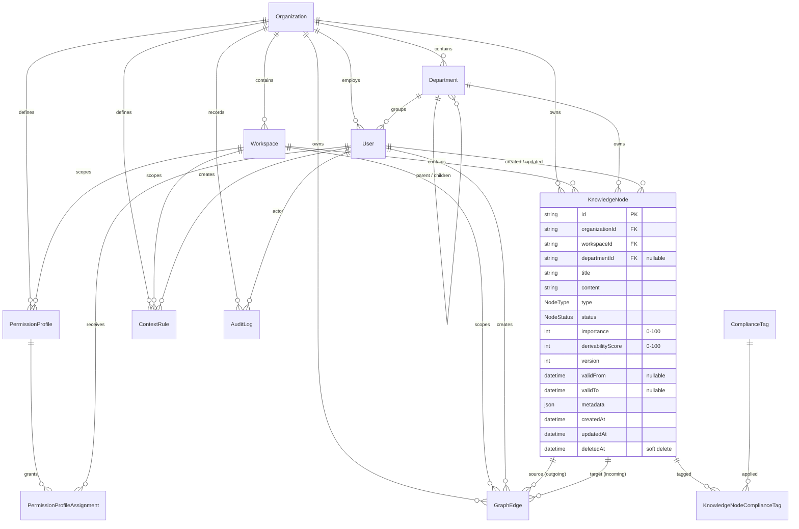

# ContextGraph — Database Architecture

> Phase 2: the data foundation. This document covers the domain model, the
> schema design rationale, index strategy, scaling, migration and seeding
> workflows, and future extensibility. No business logic is implemented — the
> schema is the deliverable.

---

## 1. ER diagram

## 2. Entities and their purpose

| Entity                        | Purpose                                                                                                                       | Notes                                                                                        |
| ----------------------------- | ----------------------------------------------------------------------------------------------------------------------------- | -------------------------------------------------------------------------------------------- |
| `Organization`                | The tenant. Every business row anchors here; it is the hard isolation boundary.                                               | `slug` unique; `configuration` JSON for tenant-level settings.                               |
| `Workspace`                   | A named knowledge container inside an org (e.g. _Inpatient Assessment_, _KYC Onboarding_). The operational security boundary. | `slug` unique per org; nodes/edges/rules/profile are workspace-scoped.                       |
| `Department`                  | Org chart; arbitrary-depth hierarchy via self-relation. Groups users and attributes knowledge.                                | NOT the security boundary. `code` unique per org, used in permission rules.                  |
| `User`                        | Identity inside a tenant. Role + permission level + compliance clearance drive permission-aware filtering.                    | `email` unique per org; `authProviderUserId` reserved for Supabase Auth.                     |
| `KnowledgeNode`               | A graph node: fact, constraint, decision or anti-pattern. The unit of retrieval, permission checking and rule evaluation.     | Carries importance (ranking), derivability score, validity window, compliance tags, version. |
| `GraphEdge`                   | A directed, typed relationship between nodes — the vocabulary of BFS traversal.                                               | Composite unique key prevents duplicate edges; `weight` steers traversal.                    |
| `KnowledgeNodeComplianceTag`  | Junction table for compliance tags.                                                                                           | A real index on `tag` enables compliance-filtered retrieval.                                 |
| `PermissionProfile`           | A named, versioned set of permission rules (JSON) consumed by the future permission compiler.                                 | `isDefault` marks the org-wide fallback; assignments are audited.                            |
| `PermissionProfileAssignment` | Explicit, audited grant of a profile to a user.                                                                               | `grantedBy` + `grantedAt`/`revokedAt` for full accountability.                               |
| `ContextRule`                 | A deterministic rule: JSON condition AST + action, priority, validity, version.                                               | Input set for the future rule engine.                                                        |
| `AuditLog`                    | Append-only event log.                                                                                                        | Doubles as the foundation for event sourcing and real-time streams.                          |

## 3. Design principles

1. **Multi-tenant by construction.** Every business table carries
   `organizationId` and every composite index keeps it leftmost, so a
   tenant-scoped query can always use a prefix — cross-tenant leakage is
   impossible to express by accident.
2. **Domain-agnostic core.** The healthcare assessment is seed data, not
   schema. Nodes/edges/rules/profile work identically for finance, legal,
   education, etc. (the seed ships a finance tenant to prove it).
3. **UUIDs everywhere, soft delete everywhere.** `@default(uuid())` for all
   PKs (no sequential enumeration of tenants or knowledge). Mutable entities
   carry `deletedAt`; queries must filter `deletedAt: null` (repositories
   enforce this contract).
4. **Audit fields everywhere.** `createdAt`/`updatedAt` on all rows,
   `createdById`/`updatedById` on content rows, and an append-only `AuditLog`
   for anything that must be provable later (compliance, forensics).
5. **Versioning by design.** `KnowledgeNode.version`, `ContextRule.version`,
   `PermissionProfile.version` prepare for the node-versioning and rule
   lifecycle modules without schema churn.

## 4. Index strategy

Indexes are chosen for the future hot paths, not today's queries.

| Hot path                         | Indexes                                                                                                                                                             |
| -------------------------------- | ------------------------------------------------------------------------------------------------------------------------------------------------------------------- |
| **BFS/DFS traversal**            | `GraphEdge (workspaceId, sourceId)` — outgoing adjacency; `(workspaceId, targetId)` — incoming adjacency; `(workspaceId, relationshipType)` — typed walks.          |
| **Organization isolation**       | Every table: `(organizationId, …)` composite with `organizationId` leftmost.                                                                                        |
| **Workspace retrieval + status** | `KnowledgeNode (workspaceId, status)`, `(workspaceId, type)`, `(workspaceId, importance)` (ranking for context assembly).                                           |
| **Department lookup**            | `Department (organizationId, hierarchyLevel)`, `(parentId)`; `User (departmentId)`; `KnowledgeNode (departmentId)`.                                                 |
| **Compliance filtering**         | `KnowledgeNodeComplianceTag (tag)` + composite PK `(knowledgeNodeId, tag)`.                                                                                         |
| **Temporal filtering**           | `KnowledgeNode (workspaceId, validFrom, validTo)` and `(workspaceId, status, validFrom, validTo)`; `GraphEdge (workspaceId, relationshipType, validFrom, validTo)`. |
| **Permission filtering**         | `User (organizationId, role)`, `(organizationId, permissionLevel)`, `(organizationId, complianceClearance)`; `PermissionProfile (organizationId, isDefault)`.       |
| **Audit / event sourcing**       | `AuditLog (organizationId, entityType, entityId, occurredAt)`, `(organizationId, actorId, occurredAt)`, `(organizationId, occurredAt)`.                             |

**Why junction table over enum array?** `complianceTags` as a Postgres enum
array would need a hand-written GIN index and non-portable queries; a
junction table gives Prisma-native indexing and filtering and works on any
relational store.

**Where to look next:** the initial migration
(`src/prisma/migrations/202608040000_init/migration.sql`) contains 34 indexes
— inspect `pg_stat_statements` or `EXPLAIN` output against real workloads in
Phase 3 and prune the rarely-used ones.## 5. Relationship and constraint rules

- All `organizationId` FKs cascade on tenant deletion — a tenant teardown
  removes its subtree atomically (business layer soft-deletes first; hard
  delete is the admin escape hatch).
- `KnowledgeNode` → `GraphEdge` cascades: edges are meaningless without their
  endpoints, so deleting a node removes its adjacency.
- Content ownership (`createdBy`, `updatedBy`) is `SetNull` — users are
  soft-deleted and must never block content.
- `GraphEdge` composite unique `(workspaceId, sourceId, targetId,
relationshipType)` prevents duplicate edges by construction.

### Soft delete × unique constraints (known trade-off)

Unique keys (`Organization.slug`, `Workspace (organizationId, slug)`,
`User (organizationId, email)`, `Department (organizationId, code)`) remain
in force for soft-deleted rows because Postgres unique constraints cannot be
partial. Consequences:

- Re-creating a resource with the same natural key after a soft delete fails
  with `DuplicateRecordError` (P2002).
- This is deliberate in Phase 2: hard-deleting the row (via the repository's
  `delete`) or reusing a different natural key are the documented escapes.
- **Phase 3 follow-up:** introduce a tombstone strategy in the user service —
  e.g. a `deletedEmail` column or a history table — so re-inviting a removed
  user with the same email works without loosening uniqueness. The schema
  already carries `deletedAt`, so the migration is additive.

## 6. Scaling strategy (thousands of organizations)

- **Row-level tenant isolation first.** All queries are org-scoped; indexes
  keep `organizationId`/`workspaceId` leftmost so the plan is index-only
  after the tenant prefix.
- **Database-per-tenant (optional later).** The schema holds no cross-tenant
  assumptions, so migrating a large tenant to a dedicated database is a
  provisioning exercise, not a refactor.
- **Partitioning.** When `KnowledgeNode`/`AuditLog` grow beyond ~100M rows,
  partition by `organizationId` (or by month for `AuditLog`); the existing
  indexes already lead with the partition key.
- **Connection pooling.** Supabase pooler (`pgbouncer`) with
  `connection_limit=1` per connection string; the Prisma singleton keeps one
  client per process (see `src/prisma/client.ts`).
- **Read replicas (later).** Traversal-heavy reads can route to replicas
  through the repository layer without touching business logic.
- **Caching (later).** Permission-compiled grants and frequently-traversed
  subgraphs are cacheable; the schema's version fields give natural cache
  invalidation keys.

## 7. Migration strategy

- Migrations live in `src/prisma/migrations/` (Prisma 6, configured in
  `prisma.config.ts`).
- **Workflow:** change `schema.prisma` → `npm run db:migrate` (dev, creates +
  applies + regenerates client) → commit the generated migration folder.
- **Deploys:** `npm run db:deploy` applies pending migrations with zero
  prompts — used by CI/CD against Supabase.
- **Reset (local only):** `npm run db:reset` drops, re-applies migrations and
  re-runs the seed.
- **Seeding:** `npm run db:seed` (idempotent; wipes and recreates only the
  seeded organizations). See `src/prisma/seed.ts`.
- **Env files:** Prisma CLI loads `.env`; Next.js loads `.env.local`.
  `prisma.config.ts` and the seed load both, so `DATABASE_URL` works wherever
  it is declared (`.env.local` wins). Document new variables in `.env.example`.

## 8. Future extensibility

The schema is designed so the later phases slot in **without refactoring**:

| Future module              | Prepared by                                                                                                          |
| -------------------------- | -------------------------------------------------------------------------------------------------------------------- |
| Graph traversal / BFS      | `GraphEdge` adjacency indexes + `weight`.                                                                            |
| Permission compiler        | `PermissionProfile.rules` (JSON), assignments, `User` role/permission/clearance indexes.                             |
| Rule engine                | `ContextRule` condition AST + `findEnabledAndValidAt`.                                                               |
| Candidate builder          | `KnowledgeNode.derivabilityScore`; a `CandidateNode` model is added next to `KnowledgeNode`.                         |
| AI context assembly        | `KnowledgeNode.importance` + temporal indexes for ranking; a `ContextPackage` model is added in the workspace scope. |
| Node versioning            | `KnowledgeNode.version`; `SUPERSEDES` edges link a node to its replacement.                                          |
| Event sourcing / real-time | Append-only `AuditLog` with `before`/`after` snapshots; Supabase Realtime can stream `AuditLog` inserts.             |
| Analytics                  | `importance`, `derivabilityScore`, timestamps and the audit trail are queryable without denormalization.             |
| Auth (Supabase)            | `User.authProviderUserId` + per-org unique email.                                                                    |

## 9. Error handling

Repositories translate vendor errors at the boundary via
`mapPrismaError` (`src/lib/errors/database/prisma-error-mapper.ts`):

| Prisma code | Domain error                     |
| ----------- | -------------------------------- |
| P2002       | `DuplicateRecordError` (409)     |
| P2003       | `ForeignKeyViolationError` (409) |
| P2025       | `RecordNotFoundError` (404)      |
| P1000–P1002 | `DatabaseConnectionError` (500)  |
| other       | generic `DatabaseError` (500)    |

Business logic never sees Prisma exceptions — only the `AppError` family.
