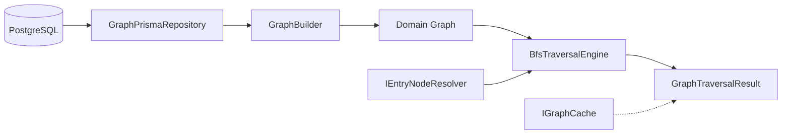
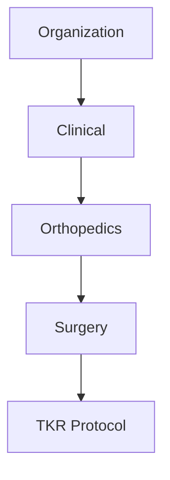
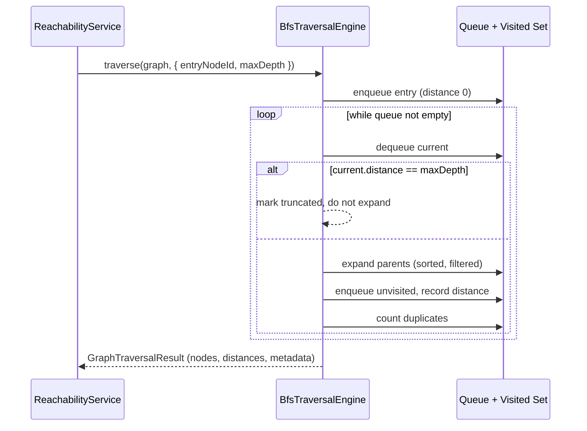
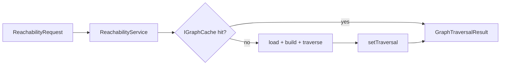

# ContextGraph — Graph Engine

> Phase 4: the reusable Graph Engine. This document covers the graph model,
> direction semantics, DAG architecture, BFS algorithm, validation, cycle
> detection, repository architecture, complexity, performance, caching, and
> future scaling. The engine is deliberately free of permission, rule, and
> ranking logic — it answers one question: _"Starting from this node, what
> nodes are reachable, in what order, and at what distance?"_

---

## 1. Graph model

The engine never sees Prisma models. Persistence rows are mapped into a
framework-agnostic domain model under `src/modules/graph/domain/`:

| Type                                             | Responsibility                                                                                                       |
| ------------------------------------------------ | -------------------------------------------------------------------------------------------------------------------- |
| `GraphNode`                                      | In-memory node: `id`, `title`, `type`, `status` (a projection — content and compliance tags belong to later modules) |
| `GraphEdge`                                      | In-memory edge: `id`, `sourceId`, `targetId`, `relationshipType`, `weight`                                           |
| `Graph`                                          | The aggregate: node map + **two precomputed adjacency views** (`parentsOf` / `childrenOf`)                           |
| `GraphTraversalRequest`                          | Input contract: `entryNodeId`, `maxDepth`, optional `relationshipTypes`, optional `direction`                        |
| `TraversalNode`                                  | A visited node with `distance`, `order`, and `parentIds`                                                             |
| `GraphTraversalResult`                           | `nodes`, `order`, `distances`, `truncated`, `metadata`                                                               |
| `GraphTraversalMetadata`                         | Raw counters: visited count, depth, edges examined, duplicates prevented, max queue, duration                        |
| `GraphMetrics`                                   | Derived view: reachable count, traversal efficiency                                                                  |
| `GraphValidationResult` / `GraphValidationError` | Integrity-check outcome and per-issue details                                                                        |



The engine (`engine/`, `services/`) depends only on the domain model and on
interfaces — never on Prisma or on the HTTP layer.

## 2. Graph direction

Direction is an **explicit domain decision**, not an assumption about the
database's `source`/`target` names.

ContextGraph stores a `GraphEdge` as `sourceId -> targetId`. The domain
interpretation is defined once in `domain/graph-direction.ts`:

- **`UP` (default)** — `source` is the _child_ (more specific knowledge),
  `target` is the _parent_ (more general / supporting knowledge). Traversal
  moves **upward toward ancestors** by following edges out of a node.
- **`DOWN`** — the reverse; traversal moves toward descendants.



With the default direction, the row `TKR Protocol -> Surgery` is stored as
`sourceId = TKR Protocol`, `targetId = Surgery`. `GraphBuilder` maps these
rows into adjacency views (`parentsOf`), and the BFS engine walks that
adjacency. A future module that needs downward traversal passes
`direction: DOWN` — the engine and builder already support it.

## 3. DAG architecture

Every workspace's knowledge graph is expected to be a **Directed Acyclic
Graph**. The DAG invariant is what makes reachability well-defined and
distance-from-entry meaningful (a cycle would make "shortest distance"
ambiguous and unbounded without a cap).

The DAG is enforced on **two planes**:

1. **Write time** — `GraphService.createEdge` (POST
   `/workspaces/:workspaceId/edges`) validates the candidate edge against the
   current workspace graph **before persisting**: a cyclic insert throws
   `GraphCycleDetectedError`, a self-reference throws `SelfReferenceError`, a
   duplicate throws a 409 conflict, and a missing endpoint throws
   `GraphNodeNotFoundError`. Only a valid insert reaches the database, after
   which cached traversals of the workspace are invalidated.
2. **Read time (optional)** — `GraphBuilder` can validate on build
   (`validate: true`). The reachability hot path keeps this off by default —
   BFS is cycle-safe via its visited set, and validation on every read would
   double the traversal cost.

A **debug-only surface** under `/debug` (admin role required) runs the same
BFS pipeline with validation enabled and no cache, returning the raw engine
metadata — so integrity failures surface as descriptive errors when
investigating a workspace.

## 4. BFS algorithm

`BfsTraversalEngine.traverse(graph, request)` implements iterative,
queue-based BFS:



Algorithmic properties:

- **FIFO queue with an index pointer** — no `Array.shift()`, so dequeue is
  O(1) and the whole walk is O(V + E).
- **Visited `Set`** — a node is expanded at most once.
- **First discovery = shortest distance** — BFS expands in non-decreasing
  hop order, so the distance recorded on first visit is the shortest.
- **No recursion** — safe for 100k+ node graphs (no call-stack risk).
- **Deterministic** — neighbors are sorted lexicographically by node id
  before enqueueing, so traversal order never depends on database insertion
  order.

### Weighted strategy (A-star / Dijkstra)

`WeightedTraversalEngine` implements the same `IGraphTraversalEngine`
contract but expands in **accumulated edge-weight order** instead of hop
level: the frontier is a binary-heap priority queue keyed by cost
(tie-broken lexicographically by node id). With the default **zero
heuristic** it reduces to uniform-cost search (Dijkstra), which is optimal
for the platform's non-negative weights; a domain heuristic can be injected
into the A-star slot without engine changes. Weighted runs additionally
populate `costs` — the accumulated weight per node — while `distance`
remains the hop count of that same lowest-cost path. The strategy is
selectable per query (`strategy: "bfs" | "weighted"`) and is part of the
cache key.

## 5. Multiple-parent handling

Nodes can have many parents. The engine treats every outgoing edge of the
current node as a candidate parent hop:

```
        entry
       /  |  \
      p1  p2  p3      <- distance 1 (three parents)
       \  |  /
        gp             <- distance 2 (shared grandparent)
```

`gp` is reached through `p1`, `p2`, and `p3`. The **first** discovery (via
`p1`, given lexicographic ordering) records `gp` at distance 2; the later
arrivals through `p2`/`p3` hit the visited set and are counted in
`duplicateVisitsPrevented` — they are never re-enqueued and never emitted
twice.

## 6. Visited-set strategy

A single `Set<GraphNodeId>` guards all expansion:

- A node is added to the set **when first discovered** (before enqueueing),
  not when popped — this prevents the same node from being enqueued twice by
  two parents in the same level.
- `duplicateVisitsPrevented` counts every time an already-visited node was
  offered again, giving operators visibility into graph redundancy.
- Because entries never leave the set, shared ancestors and diamond shapes
  terminate correctly even in cyclic graphs.

## 7. Distance calculation

`distances` maps every visited node to its shortest hop distance from the
entry:

```
entry = 0
parent = 1
grandparent = 2
great-grandparent = 3
```

Distances are the foundation for later modules: context compression,
candidate ranking, importance scoring, and context assembly all consume
`TraversalNode.distance`. Because BFS discovers in level order, the recorded
distance is always the minimum for unweighted hops.

## 8. Cycle detection

`CycleDetector` uses **Kahn's algorithm** (iterative topological sort):

- **Why Kahn's over recursive DFS:** fully iterative (no stack overflow at
  100k nodes), O(V + E), and it produces a topological ordering as a side
  effect that validation and future ordering modules can reuse.
- Nodes with in-degree 0 are removed repeatedly. Any node that remains has
  in-degree ≥ 1 and therefore belongs to (or hangs off) a cycle.
- A deterministic walk over the remaining subgraph extracts **one concrete
  cycle path** (e.g. `a -> b -> c`), with acyclic tails pruned so they are
  never reported as part of the cycle.
- Determinism: the initial queue and every walk step are ordered by
  lexicographic node id.

BFS itself is never used for cycle detection — the visited set only prevents
infinite loops; `CycleDetector` is the authority on the DAG invariant.

## 9. Graph validation

`GraphValidator.validate(nodes, edges)` reports every integrity violation in
one pass, typed via `GraphValidationIssueType`:

| Issue            | Meaning                                                            |
| ---------------- | ------------------------------------------------------------------ |
| `MISSING_NODE`   | An edge references a node absent from the node set (broken edge)   |
| `SELF_REFERENCE` | An edge connects a node to itself                                  |
| `DUPLICATE_EDGE` | The same `(source, target, relationshipType)` triple appears twice |
| `INVALID_EDGE`   | An edge is missing its id or an endpoint                           |
| `CYCLE`          | The graph contains at least one directed cycle (with the path)     |

`GraphBuilder.build` with `validate: true` throws `GraphCycleDetectedError`
for cycles and `InvalidGraphError` (carrying all issues) otherwise. The edge
creation path (`GraphService.createEdge`) maps the same issues to precise
errors (self-reference, duplicate → 409, missing node) so API consumers get
a targeted response. Errors never leak raw database errors to API consumers.

## 10. Repository architecture

```
IGraphRepository (abstract contract)
        │ implements
        ▼
GraphPrismaRepository (Prisma implementation)
```

Dependency inversion: the engine depends on `IGraphRepository`, and the
module binds the Prisma implementation. The repository exposes adjacency-
shaped queries (`findEdgesBySource`, `findEdgesByTarget`, `findTypedEdges`)
plus **batched** loads:

- `findEdgesByWorkspace(org, workspace)` — one query for all edges.
- `findNodesByIds(org, ids)` — one batched query for node projections.

Reachability therefore costs **2 queries per workspace, regardless of graph
size** — no N+1. Every query is org-scoped, so tenant isolation is a query-
plan property, not a post-filter.

## 11. Complexity analysis

| Operation                  | Time             | Space    | Notes                                 |
| -------------------------- | ---------------- | -------- | ------------------------------------- |
| BFS traversal              | O(V + E)         | O(V)     | visited set + queue + distance maps   |
| Weighted (A-star/Dijkstra) | O((V + E) log V) | O(V)     | binary-heap priority queue            |
| Neighbor sort              | O(E log k)       | —        | k = max branching; bought determinism |
| Cycle detection            | O(V + E)         | O(V)     | Kahn's, index-based queue             |
| Validation                 | O(V + E)         | O(V)     | single pass + cycle check             |
| Graph build                | O(V + E)         | O(V + E) | two batched DB queries                |

Empirical benchmark (dense DAGs, `npm run bench:graph` in `apps/api`):

```
nodes     edges     BFS       weighted
100       294       1.01 ms   1.92 ms
1,000     2,994     2.70 ms   4.21 ms
10,000    29,994    28.4 ms   38.3 ms
100,000   299,994   254 ms    331 ms
```

Scaling is linear in practice — 100k nodes traverse in ~254 ms (BFS) or
~331 ms (weighted) with zero recursion and no heap growth beyond the
visited structures.

## 12. Performance considerations

- **Batch loading** — the repository loads a whole workspace in two queries;
  the domain graph is built once and reused across traversals.
- **Minimal allocations** — the engine reuses arrays and avoids closures in
  the hot loop; the hop list is built per node and discarded.
- **Index-based queue** — O(1) dequeue instead of `shift()`.
- **Depth bound** — `maxDepth` (validated 1–64 at the API layer, up to
  10,000 at the engine) guarantees a bounded walk even on corrupt graphs.
- **Validation off the hot path** — read-time validation is opt-in
  (`VALIDATE_GRAPH_ON_READ`); correctness is enforced at write time.

## 13. Caching strategy

`IGraphCache` is the cache contract; the module binds `InMemoryGraphCache`
on top of the common in-memory provider. The engine is cache-agnostic.

Traversal strategy is part of the cache key, so a BFS result and a weighted
result for the same query are never confused.



- Keys are scoped `graph:traversal:{org}:{workspace}:{query}` — tenant
  isolation holds at the cache boundary.
- Workspace-scoped invalidation removes every entry of a workspace when
  edges change.
- A future `RedisGraphCache` swaps in by changing one provider binding — no
  engine code changes. (Redis serialization of the result's `Map`s is a
  documented concern for that future implementation.)

## 14. Future scaling strategy

The engine is built to be consumed by the permission, rule, and candidate
modules without structural changes:

- **Permission engine** — receives the reachable node set and applies
  per-node policies; the engine itself never filters by permission.
- **Cached adjacency** — `GraphBuilder` output is a pure in-memory value;
  memoizing it per workspace (memory or Redis) is a drop-in optimization.
- **Precomputed ancestry** — for very deep graphs, a materialized
  transitive-closure projection can be layered behind `IGraphRepository`
  without touching the engine.
- **Traversal strategies** — implemented: both `BfsTraversalEngine` and
  `WeightedTraversalEngine` (A-star/Dijkstra) implement the shared
  `IGraphTraversalEngine` contract and are selectable per query via the
  `strategy` field (`bfs` | `weighted`, part of the cache key). A domain
  heuristic can be injected into the weighted engine's A-star slot later.
- **Streaming / analytics** — `GraphMetrics` is already decoupled from any
  telemetry backend (Prometheus, Datadog) via the collector service.

---

### Engine boundaries (what this phase deliberately excludes)

The engine contains **no** permission checks, role checks, organization
checks, compliance rules, temporal rules, derivability scoring, AI logic, or
candidate ranking. Those belong to later modules and operate _on top of_ the
reachability result.
