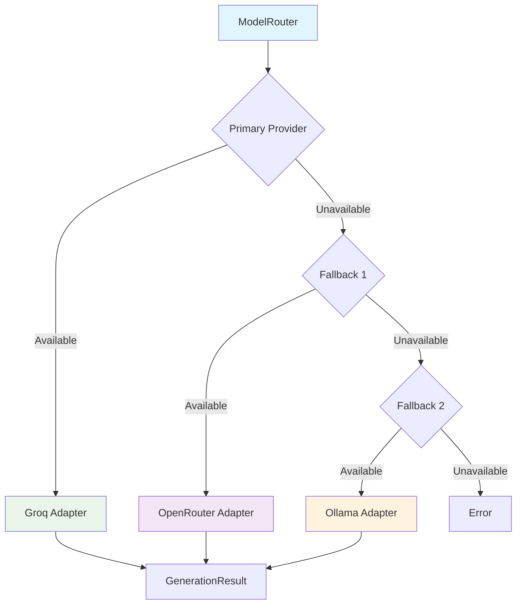

# Model Gateway

The Model Gateway provides a provider-independent abstraction for LLM communication.

## Architecture



## Provider Adapters

### Groq Adapter

- OpenAI-compatible API
- Fast inference (Groq hardware acceleration)
- No SDK dependency (uses native fetch)
- Automatic fallback through free model list

**Free Models:**

- llama-3.3-70b-versatile (primary)
- llama-3.1-8b-instant
- mixtral-8x7b-32768
- gemma2-9b-it
- llama3-groq-8b-8192-tool-use-preview
- llama3-groq-70b-8192-tool-use-preview

### OpenRouter Adapter

- Multi-provider gateway
- Access to OpenAI, Anthropic, Google, Meta, and more
- OpenAI-compatible API
- Automatic fallback through free model list

**Free Models:**

- meta-llama/llama-3.3-70b-instruct:free (primary)
- meta-llama/llama-3.1-8b-instruct:free
- mistralai/mistral-7b-instruct:free
- google/gemma-2-9b-it:free
- qwen/qwen-2-7b-instruct:free
- microsoft/phi-3-mini-128k-instruct:free

### Ollama Adapter

- Local model support
- No API key required
- Privacy-sensitive deployments
- Development and testing

## Model Configuration

```typescript
interface ModelConfiguration {
  provider: ModelProvider;
  model: string;
  temperature: number;
  maxOutputTokens: number;
  timeout: number;
  retryPolicy: RetryPolicy;
  isLocal: boolean;
}
```

## Model Fallback

The system automatically falls back through free models when the primary model fails.

### Fallback Strategy

1. **Primary Model**: Try the configured primary model
2. **Model Fallback**: If primary fails, try next free model in the list
3. **Provider Fallback**: If all models in provider fail, try next provider
4. **Local Fallback**: Last resort is local Ollama

### Failure Tracking

- Models that fail 3+ times are temporarily skipped
- Success resets the failure counter
- Each adapter maintains its own failure counts

### Example Flow

```
Request → Groq (llama-3.3-70b-versatile)
  ↓ (fails)
Groq (llama-3.1-8b-instant)
  ↓ (fails)
Groq (mixtral-8x7b-32768)
  ↓ (fails)
OpenRouter (meta-llama/llama-3.3-70b-instruct:free)
  ↓ (fails)
OpenRouter (meta-llama/llama-3.1-8b-instruct:free)
  ↓ (fails)
Ollama (local)
```

## Model Routing

The ModelRouter routes requests based on:

1. Primary provider availability
2. Circuit breaker state
3. Fallback configuration

### Default Configuration

```bash
AI_PRIMARY_PROVIDER=GROQ
AI_FALLBACK_PROVIDERS=OPENROUTER,OLLAMA
```

## Circuit Breaker

Provider resilience through circuit breaker pattern:

- **CLOSED**: Normal operation
- **OPEN**: Provider failed, skip temporarily
- **HALF_OPEN**: Testing recovery

## Retry Policy

```typescript
interface RetryPolicy {
  maxRetries: number;
  baseDelayMs: number;
  maxDelayMs: number;
  backoffMultiplier: number;
}
```

## Usage Example

```typescript
// Route to appropriate provider
const config = await modelRouter.route(request);

// Generate response
const gateway = await getGateway(config.provider);
const result = await gateway.generate({
  systemPrompt: prompt.systemPrompt,
  userPrompt: prompt.userPrompt,
  contextHash: context.contextHash,
  promptVersion: prompt.promptVersion,
  configuration: config,
  requestId,
});
```

## Observability

Tracked metrics:

- Model calls per provider
- Latency per request
- Token usage
- Circuit breaker state changes
- Fallback events
