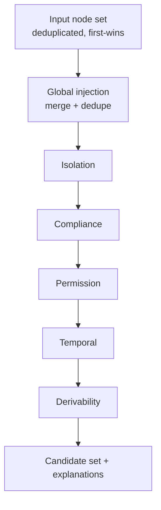
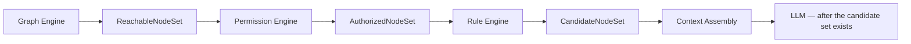

# Rule Engine — Phase 6

The ContextGraph **Deterministic Rule Engine**. It receives nodes that the Graph
Engine discovered and the Permission Engine authorized, and progressively
filters them into a high-quality context candidate set.

The engine answers one question deterministically: _"Which authorized nodes
should remain in the final context?"_ It never answers _"what is reachable?"_
(Graph Engine) or _"who may see this?"_ (Permission Engine), and it contains
**zero LLM involvement** — identical input always produces identical output.

```
User Context
     ↓
Graph Traversal        (Phase 4 — reachable nodes)
     ↓
Global / Zone-2 Injection
     ↓
Permission Authorization  (Phase 5 — authorized nodes)
     ↓
Rule Engine            (this phase — candidate set)
     ↓
Candidate Nodes
```

## 1. Rule Engine Architecture

Layers (Clean Architecture, dependency inversion throughout):

```
┌────────────────────────────────────────────────────────────────┐
│                        RuleEngineModule                        │
│                                                                │
│  Controller              GET /rule-engine/definition (read-only)│
│                               │                                │
│  Application service     IRuleEngineService (facade)           │
│                               │                                │
│  Pipeline                RulePipeline (enforces priority order)│
│                               │                                │
│  Rules                   Isolation → Compliance → Permission → │
│                          Temporal → Derivability (IRule)       │
│                               │                                │
│  Domain                  RuleCandidateNode, RuleExecutionContext│
│                          RuleEvaluationResult, RuleReasonCode  │
│                               │                                │
│  Infrastructure          IGlobalKnowledgeProvider  IRuleCache  │
│                          IRuleMetrics  IRuleAuditLogger        │
└────────────────────────────────────────────────────────────────┘
```

Every dependency is an interface token (`IGlobalKnowledgeProvider`,
`IGlobalKnowledgeInjector`, `IDerivabilityEvaluator`, `IRulePipelineFactory`,
`IRuleCache`, `IRuleMetrics`, `IRuleAuditLogger`) bound to an in-memory
implementation in `rule-engine.module.ts`. Redis caching, a database-backed
global-policy store, or a Prometheus exporter replace one binding — never rule
code.

**Module independence:** the engine has no dependency on React, Next.js,
controllers, or the graph engine. It imports `AuthorizationModule` only to
reuse the compiled-context + in-memory evaluator for the permission rule.

## 2. Rule Contract

```ts
export abstract class IRule {
  abstract readonly definition: RuleDefinition; // id, name, enabled, priority, configuration
  abstract evaluate(
    context: RuleExecutionContext,
    node: RuleCandidateNode,
  ): RuleEvaluationResult;
}
```

A rule is a **pure function** of `(context, node)`:

- No I/O, no clock (the evaluation instant is injected in the context), no
  shared mutable state.
- Returns a structured result — never a bare boolean:

```jsonc
{
  "ruleId": "temporal",
  "nodeId": "node-42",
  "passed": false,
  "reason": "Node status is EXPIRED",
  "reasonCode": "EXPIRED_NODE", // stable, machine-readable
  "evaluatedAt": "2026-06-15T12:00:00.000Z",
}
```

`RuleReasonCode` is part of the API contract: `PASS`, `NOT_APPLICABLE`,
`ORG_MISMATCH`, `MISSING_CLEARANCE`, `INSUFFICIENT_PERMISSION`,
`EXPIRED_NODE`, `SUPERSEDED_NODE`, `FUTURE_EFFECTIVE_NODE`, `NOT_ACTIVE`,
`DERIVABLE_CONTENT`, `EXPLICIT_DISCARD`. New rules add codes; existing ones
never change meaning.

## 3. Pipeline Execution

`RulePipeline` runs **rule-major** (outer loop over rules, inner loop over the
surviving node set):



- A node failing any rule is **removed forever** — it cannot reappear in a
  later stage.
- Every node accumulates one `RuleEvaluationResult` per rule, so every
  inclusion and exclusion is fully explainable.
- Complexity: **O(V × R)** evaluations, **O(V)** memory (V = deduplicated +
  injected node count, R = enabled rule count). Zero database access.

## 4. Rule Ordering

Ordering is **explicit, never array position**: rules are sorted by
`priority` ascending, then `id` ascending — enforced inside the pipeline
constructor itself, so even an unsorted construction cannot violate it.

| Priority  | Rule id            | Responsibility                                       |
| --------- | ------------------ | ---------------------------------------------------- |
| (stage 0) | `global-injection` | Merge organization-wide knowledge (injector)         |
| 20        | `isolation`        | Defense-in-depth tenant boundary                     |
| 30        | `compliance`       | Clearance tags against the compiled context          |
| 40        | `permission`       | Re-verify READ through the authorization engine      |
| 50        | `temporal`         | Validity window + lifecycle status                   |
| 60        | `derivability`     | Drop generic content a foundation model could derive |

Rationale: the tenant boundary is cheapest and most critical (first); clearance
gates precede capability gates; temporal and derivability compression run last,
over an already-tightened set. Rules can be disabled or re-prioritized per
configuration; the `executedStages` trace reports the exact order of a run.

## 5. Global Knowledge Injection

Some knowledge must be included regardless of the local traversal:
organization-wide safety policies, global compliance rules, critical
constraints. `IGlobalKnowledgeProvider.findGlobalNodes(context)` is the seam
(default binding supplies nothing); `GlobalKnowledgeInjector` merges provider
nodes, deduplicates by id (first occurrence wins), and stamps injected nodes
with `inclusionReason = GLOBAL_POLICY`:

```
LOCAL_REACHABILITY  — reached from the entry node
GLOBAL_POLICY       — injected as organization-wide knowledge
EXPLICIT_CONTEXT    — reserved for future explicit context requests
```

Injected global nodes are **not exempt** from the rules — the permission rule
verifies the caller may read them (invariant 6b).

## 6. Isolation (defense-in-depth)

`IsolationRule` re-verifies `node.organizationId === context.organizationId`
against the **server-derived tenant of the compiled context** (the request
never carries an organization id). Foreign or missing identifiers fail closed
with `ORG_MISMATCH`. The permission engine remains the primary isolation gate;
this rule guarantees the boundary inside the candidate set.

## 7. Compliance

`ComplianceRule` checks every node tag against the **already compiled**
`CompiledAuthorizationContext.effectiveComplianceTags` — a deterministic
O(tags) subset test with no database access. A single missing tag denies with
`MISSING_CLEARANCE` and the missing tags in metadata. Nodes with no tags pass
(rule not applicable). This mirrors the authorization engine's compliance
policy without duplicating it — the compiled context is the shared source of
truth.

## 8. Permission

`PermissionRule` **delegates** to `IAuthorizationEvaluator.evaluate(compiledContext,
nodeAsResource, READ)` — it contains zero authorization logic of its own. Nodes
are mapped into `ResourceAuthorizationContext` via
`candidateNodeToResourceContext` (visibility from metadata, same contract as
the knowledge and graph mappers). The full decision — failing policy, reason,
evaluated policies — is preserved in the result metadata. This rule also
covers globally injected nodes (invariant 6b).

## 9. Temporal Validity

Semantics (documented; implemented in `TemporalRule`):

- Window is **inclusive** on both ends: valid iff
  `(validFrom == null || validFrom <= evaluatedAt) && (validTo == null || validTo >= evaluatedAt)`.
- All timestamps are UTC ISO-8601; comparison uses epoch millis — no timezone
  ambiguity. The evaluation instant is injected per run (defaults to now,
  overridable for deterministic replay).
- `SUPERSEDED` → remove (`SUPERSEDED_NODE`).
- `EXPIRED` → remove (`EXPIRED_NODE`).
- `DRAFT` / `ARCHIVED` → remove (`NOT_ACTIVE`) — drafts are unpublished,
  archived nodes are retired (fail-secure default).
- `LEGAL_HOLD` → keep regardless of window (`legalHoldOverridesExpiry`,
  default true) — held content must remain retrievable.
- `REVIEW_REQUIRED` → keep, flagged in result metadata (still valid).
- `ACTIVE` → subject to the window bounds (`FUTURE_EFFECTIVE_NODE` /
  `EXPIRED_NODE`).

## 10. Derivability

Deterministic only — **no LLM**. `IDerivabilityEvaluator` is the swappable
seam (future: metadata-embedding, LLM-assisted, org-specific strategies all
implement the same contract). The default `DeterministicDerivabilityEvaluator`:

1. `metadata.keep === true` → preserve; `=== false` → discard (explicit wins).
2. `derivabilityScore` (0-100, higher = more generic) → derivable when
   `score >= threshold` (default 80, configurable, clamped 0-100).
3. No score → type heuristic: bare `FACT`s are assumed generic
   (foundation models know common facts); `CONSTRAINT`/`DECISION`/
   `ANTI_PATTERN` are organization-specific policy and preserved.

`DerivabilityRule` translates the decision into a structured pass/fail with
the reason (`SCORE_ABOVE_THRESHOLD`, `ORGANIZATION_SPECIFIC`, `EXPLICIT_KEEP`,
`EXPLICIT_DISCARD`) in metadata.

## 11. Determinism

For identical user, graph, authorization state, node state, configuration and
evaluation timestamp, the result is identical. Guarantees:

- No `Math.random`, no uncontrolled concurrency, no LLM calls.
- The evaluation instant is injected; rules never read the clock.
- Ordering is explicit: rules by (priority, id), nodes by input order, global
  nodes by provider order, duplicates by first occurrence.
- `Map`/`Set` iteration is insertion-ordered, so no iteration-order surprises.
- A test asserts byte-identical output (excluding wall-clock timings) for two
  identical runs.

## 12. Explainability

Every node carries a `NodeRuleExplanation`: `included`, `finalReasonCode`,
`failingRuleId`, and the full ordered `ruleResults`. This powers the
"why was this included/excluded?" UI, audit trails and analytics:

```
Internal Deployment SOP
  isolation:    PASS
  compliance:   PASS
  permission:   PASS
  temporal:     FAIL  → EXPIRED_NODE
  final:        REMOVED
```

`RuleExecutionMetrics.removedByReason` gives the funnel at a glance.

## 13. Metrics

Per run (`RuleExecutionMetrics`): `initialCount`, `injectedCount`,
`finalCount`, `totalDurationMs`, ordered `countsAfterStage`, `removedByRule`,
`removedByReason`, `ruleDurationsMs`. Aggregates live behind `IRuleMetrics`
(in-memory today; Prometheus-ready seam).

```
Initial reachable:    120
After global injection: 135
After isolation:       130
After compliance:      115
After permission:       90
After temporal:         72
After derivability:     28
```

## 14. Error Handling

Two distinct failure classes:

| Kind                          | Behavior                                                                 |
| ----------------------------- | ------------------------------------------------------------------------ |
| **Expected rule failure**     | Node fails a rule → removed with a reason                                |
| **System error** (rule threw) | `RuleExecutionException` (500) — never silently swallowed, fail securely |

Configuration errors fail fast: unknown or duplicate rule ids throw
`RuleEngineConfigurationException` (500) at pipeline build time — a
misconfigured engine never runs silently. Input sets above `maxNodes`
(default 100,000) throw `RuleEngineLimitException` (400).

## 15. Performance

- Zero database queries during evaluation: one context compile (cached by the
  authorization engine), one optional global-policy read, then pure in-memory
  passes.
- O(V × R) evaluations with O(V) memory; `Set`-based survival tracking; no
  recursion; no per-node allocation beyond the explanation records.
- Benchmark — `npm run bench:rules` (5 rule passes, zero DB access):

```
nodes=100        total=1.7ms    removed=80
nodes=1,000      total=2.7ms    removed=800
nodes=10,000     total=29.7ms   removed=8,000
nodes=100,000    total=267ms    removed=80,000
```

## 16. Future Rule Extensions

New rules (relevance, source trust, jurisdiction, geo-restrictions, user
preferences, freshness, document quality, legal restrictions, data residency,
custom enterprise rules) are addable without touching existing rules:

1. Implement `IRule` with a `RuleDefinition` (id, name, enabled, priority,
   configuration).
2. Add a `case` in `RulePipelineFactory.buildRules`.
3. Give it an explicit priority in the configuration.

The pipeline contract, the execution context, the result type, the metrics
funnel, the audit seam and the cache seam all stay unchanged. Per-organization
persisted configuration (future phase) replaces the static default while the
pipeline contract remains identical.

## Integration contract



The engine consumes `AuthorizedNodeSet` (`RuleCandidateNode[]`) and produces
`FilteredCandidateSet` (`RuleEngineResponse`). It never traverses the graph and
never authenticates. LLM integration, when it arrives, consumes the candidate
set produced by this engine — the engine itself never depends on an LLM.
